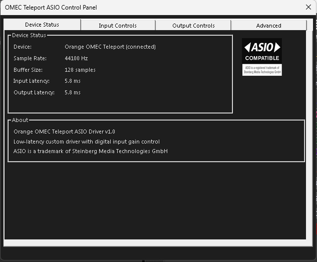
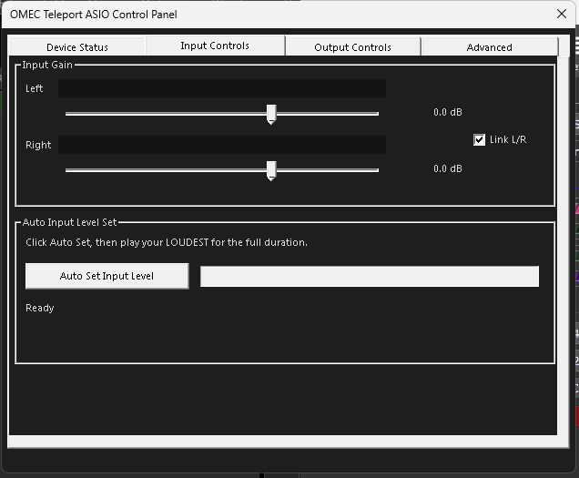
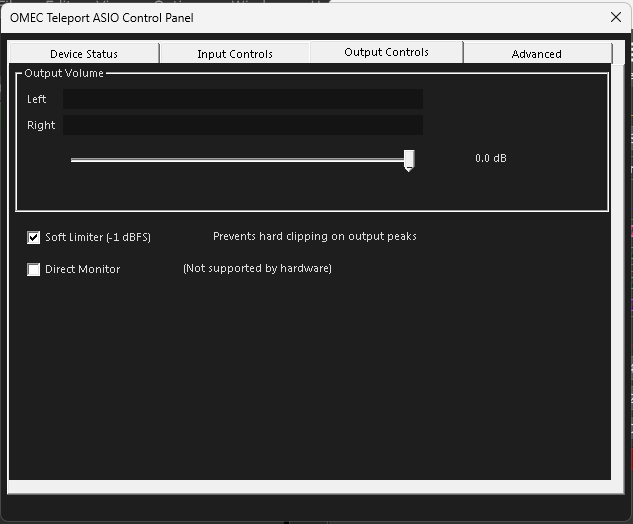
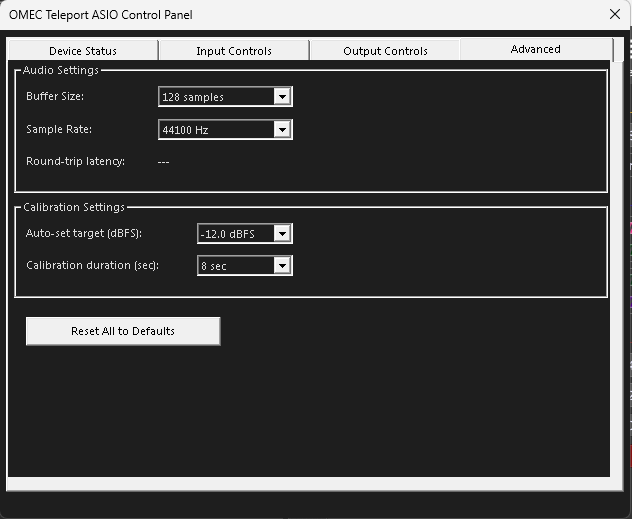

# OMEC Teleport ASIO Driver

A custom ASIO driver for the **Orange OMEC Teleport** USB guitar pedal on Windows, built for low-latency live performance with [Gig Performer](https://gigperformer.com/) and other ASIO-compatible DAWs.

## Why This Driver?

The OMEC Teleport's input stage runs hot, causing digital clipping before your DAW can process the signal. This driver provides:

- **Digital input gain attenuation** -- tame the hot input before it reaches your plugins
- **32-bit float ASIO buffers** -- full dynamic range, zero conversion overhead
- **Auto Input Level Set** -- click, play your loudest, and the driver sets gain to target -12 dBFS
- **Soft limiter** -- tanh-based soft clip at -1 dBFS prevents hard clipping on output
- **Dark-themed control panel** -- embedded in the DLL with real-time peak meters, gain sliders, and calibration controls
- **Low latency** -- tested clean at 64-sample buffers
- **Drift correction** -- ring buffer trimming keeps latency stable over long sessions

## Control Panel

<p align="center">


</p>
<p align="center">


</p>

## Architecture

The driver uses **WASAPI shared mode** as its audio backend rather than WinUSB or WASAPI exclusive mode. This avoids known timing issues with USB Audio Class 1.0 (Full Speed) devices in exclusive mode, while keeping latency low.

```
Guitar -> OMEC Teleport (USB) -> Windows inbox USB audio driver
  -> WASAPI shared mode (float32) -> Ring buffer -> ASIO float32 buffers
  -> Gig Performer / DAW -> ASIO float32 output -> Ring buffer
  -> WASAPI shared mode (float32) -> OMEC Teleport (USB) -> Amp/Monitor
```

No custom kernel driver, no INF file, no driver signing required.

## Requirements

- **Windows 10/11** (64-bit)
- **Visual Studio 2022 or later** (Community edition is fine) with C++ Desktop workload
- **Steinberg ASIO SDK 2.3+** (see [ASIOSDK/README.md](ASIOSDK/README.md) for download instructions)
- **Orange OMEC Teleport** pedal

## Building

1. **Obtain the ASIO SDK** -- download from [steinberg.net/asiosdk](https://www.steinberg.net/asiosdk) and extract into the `ASIOSDK/` folder so that `ASIOSDK/common/asio.h` exists.

2. **Open the solution** -- double-click `OmecTeleportASIO.sln` in Visual Studio.

3. **Select configuration** -- choose `Release | x64` (or `Debug | x64` for development).

4. **Build** -- `Ctrl+Shift+B` or Build > Build Solution.

5. **Register the driver** -- run `installer\install.bat` as Administrator. This calls `regsvr32` to register the ASIO COM server.

## Installation (Pre-built)

If you have a pre-built `OmecTeleportASIO.dll`:

1. Place it in a permanent location (e.g., `C:\Program Files\OmecTeleportASIO\`)
2. Open an Administrator command prompt
3. Run: `regsvr32 "C:\Program Files\OmecTeleportASIO\OmecTeleportASIO.dll"`

Or download the latest release zip, extract, and right-click `install.bat` > **Run as administrator**.

## Setup

### Critical: Match Sample Rates

Both the OMEC Teleport capture and playback endpoints **must** be set to the same sample rate in Windows:

1. Right-click the speaker icon in the taskbar > **Sound settings**
2. Scroll down > **More sound settings**
3. **Recording** tab > right-click **"Line (USB AUDIO CODEC)"** > Properties > Advanced > set to **48000 Hz** (or 44100 Hz)
4. **Playback** tab > right-click **"Speakers (USB AUDIO CODEC)"** > Properties > Advanced > set to the **same rate**

Mismatched rates will cause pitch shifting and distortion.

### Using with Gig Performer

1. Open Gig Performer
2. Go to **Options > Audio Setup**
3. Select **"OmecTeleport ASIO"** as the audio device
4. Set buffer size (128 recommended; 64 works if your system handles it)
5. Set sample rate to match your Windows Sound settings
6. Click **Apply**

### Auto Input Level Set

1. Open the Control Panel > **Input Controls** tab
2. Click **Auto Set Input Level**
3. **Play your guitar at its loudest** (hardest strumming, loudest pickup) for the full countdown duration
4. The driver measures true peak and sets gain so peaks land at -12 dBFS (top of green, barely yellow)

### Peak Meter Colors

| Color | Level | Meaning |
|-------|-------|---------|
| Green | Below -12 dBFS | Safe operating level |
| Yellow | -12 to -3 dBFS | Getting hot |
| Red | Above -3 dBFS | Clipping danger |

## Troubleshooting

| Problem | Solution |
|---------|----------|
| "Can't Start Device" in DAW | Ensure OMEC Teleport is plugged in and shows in Windows Sound settings |
| Distorted / robotic sound | Check that capture and playback sample rates match (see Setup above) |
| No sound at 44100 Hz | Set both endpoints to 48000 Hz in Windows Sound settings |
| Driver not listed in DAW | Run `installer\install.bat` as Administrator |
| Device not found after replug | Close and reopen your DAW -- WASAPI re-enumerates on restart |
| Latency increases over time | Drift correction handles this automatically; if severe, restart the stream |

## Uninstalling

Run `installer\uninstall.bat` as Administrator, or:

```
regsvr32 /u "path\to\OmecTeleportASIO.dll"
```

## Project Structure

```
OmecTeleportASIO.sln          -- Visual Studio solution
driver/
  driver.vcxproj              -- project file
  exports/driver.def          -- DLL exports
  src/
    OmecTeleportASIO.h/cpp    -- ASIO driver implementation
    WasapiEngine.h/cpp        -- WASAPI shared mode backend + ring buffers
    GainProcessor.h/cpp       -- gain, peak metering, calibration, soft limiter
    TruePeakDetector.h        -- ITU-R BS.1770 true peak (4x oversampled)
    ControlPanel.h/cpp        -- Win32 dark-themed tabbed control panel
    RegistrySettings.h/cpp    -- persistent settings via HKCU registry
    Guids.h                   -- COM CLSID
    dllmain.cpp               -- COM factory + registration
    resource.h/rc             -- dialog resources
    asio_logo.bmp             -- ASIO Compatible logo
screenshots/                  -- control panel screenshots
ASIOSDK/                      -- Steinberg ASIO SDK (not included, see README)
installer/
  install.bat                 -- register DLL (run as admin)
  uninstall.bat               -- unregister DLL
```

## License

This project is licensed under the [MIT License](LICENSE).

The Steinberg ASIO SDK is required to build but is **not included** in this repository. It is subject to Steinberg's own licensing terms. See [ASIOSDK/README.md](ASIOSDK/README.md).

"ASIO" is a trademark of Steinberg Media Technologies GmbH.
